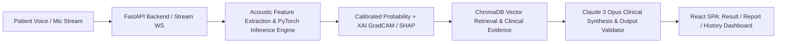

# Parkinson's Disease Voice Screening & Decision-Support System

[](tests/)
[](frontend/src/tests/)
[](docker-compose.yml)
[](PROJECT_STATE.md)

---

## 1. Regulatory & Clinical Decision-Support Notice

> [!WARNING]
> **SCREENING AND DECISION-SUPPORT TOOL ONLY — NOT A STANDALONE DIAGNOSTIC DEVICE**
> This AI software system is intended exclusively for investigational research, phonatory acoustic screening, and clinical decision support under the supervision of licensed healthcare professionals. It does **not** provide a standalone diagnosis of Parkinson's Disease and must not replace standardized neurological examinations (e.g., MDS-UPDRS), clinical history, or medical evaluations.

---

## 2. Overview & Key Capabilities

This system provides an end-to-end multimodal pipeline for detecting phonatory biomarkers associated with Parkinson's Disease (dysphonia, hypophonia, articulatory instability, jitter, shimmer, HNR, and formants) from audio recordings and chunked real-time microphone streams:

- **Multimodal Acoustic Model (`model/exported/model_v1.0.0/`)**: Fusion of ConvNeXt-V2 (multi-spectrogram representation: Mel, STFT, CQT), Temporal Transformer attention, self-supervised ASR speech representations, and eGeMAPS acoustic features.
- **Isotonic Calibration & Uncertainty Quantification**: Produces calibrated class probabilities with 95% Confidence Interval error bands ($0\% - 100\%$) and automatic quality rejection when `audio_quality_score < 4.0`.
- **Tri-Modal Explainable AI (XAI)**: Saliency Grad-CAM heatmaps, Temporal Attention timeline rollout, and signed SHAP feature attribution with layperson-accessible acoustic glossaries.
- **RAG Clinical Report Generator**: Dense vector retrieval of clinical literature chunks from trusted sources (MDS-UPDRS, Movement Disorders, Journal of Speech & Hearing Research) and Claude 3 Opus clinical synthesis protected by strict Pydantic output validation.
- **Responsive Clinical Frontend**: React 18 + TypeScript SPA with live streaming audio capture, drag-and-drop file upload, probability gauge, XAI visualizers, print/PDF clinical reports, and longitudinal patient trajectory graphs.

---

## 3. Architecture Overview



Detailed architecture diagrams and directory responsibility maps are documented in [docs/architecture/ARCHITECTURE.md](docs/architecture/ARCHITECTURE.md).

---

## 4. Quick Start (Single-Command Docker Compose)

The entire stack (PostgreSQL + ChromaDB + FastAPI backend + React SPA frontend) runs with Docker Compose:

```bash
# 1. Clone repository
git clone https://github.com/organization/pd-voice-screening.git
cd pd-voice-screening

# 2. Configure environment
cp .env.example .env
# Set your ANTHROPIC_API_KEY in .env

# 3. Launch full stack
docker compose up -d

# 4. Open in browser
# Frontend UI: http://localhost:3000
# Backend API Docs: http://localhost:8000/docs
# Health Check: http://localhost:8000/api/v1/health
```

---

## 5. Local Development & Testing

### Backend (Python 3.11 / 3.13)
```bash
# Setup virtual environment and run backend
./scripts/run_backend.sh

# Run pytest backend test suite (24 tests)
backend/pd-voice-backend/bin/python -m pytest tests/ -v
```

### Frontend (React 18 / TypeScript / Vite)
```bash
# Launch Vite dev server on port 3000
./scripts/run_frontend.sh

# Run Vitest component & e2e test suite (66 tests)
cd frontend && npm test
```

---

## 6. Documentation Index

- [Architecture & System Design](docs/architecture/ARCHITECTURE.md)
- [Model Card & Clinical Limitations](docs/model/MODEL_CARD.md)
- [Model Training & Calibration Pipeline](docs/model/TRAINING.md)
- [Model Evaluation & Subgroup Robustness](docs/model/EVALUATION.md)
- [Explainable AI (XAI) Architecture](docs/model/XAI.md)
- [REST & WebSocket API Reference](docs/api/API.md)
- [Retrieval-Augmented Generation (RAG) System](docs/rag/RAG.md)
- [LLM Synthesis & Output Validation](docs/rag/LLM.md)
- [Production Deployment & Rollback Runbook](docs/deployment/DEPLOYMENT.md)
- [Security, Privacy, and Audio Retention](docs/SECURITY.md)
- [Testing & Quality Assurance Guide](docs/testing/TESTING.md)
- [Project State & Milestone Tracker](PROJECT_STATE.md)
