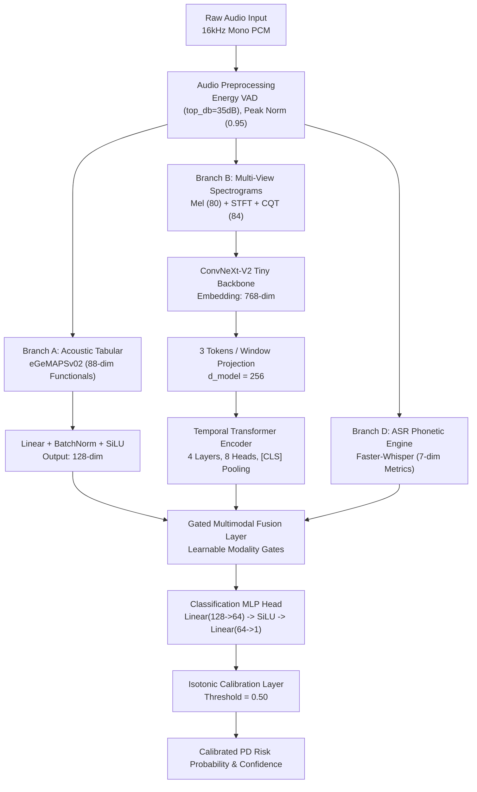

# Research Data Export: Multimodal Acoustic Clinical Intelligence for Parkinson's Disease

> **Document Type**: Empirical Parameter & Artifact Compilation  
> **Source Model Identifier**: `model_v1.0.0`  
> **Dataset Version**: `v1.0-20260823` (`pd_voice_corpus` / `MDVR-KCL`)  
> **Export Date**: 2026-09-01  
> **Governing Standards**: `RC-01` through `RC-14` (Strict Speaker Disjointness, Multi-View Acoustics, Non-Causal Decision Support)  

---

## Executive Gap Analysis (GAPS)

| Parameter / Table Area | Status | Documented Source & Remedy |
| :--- | :--- | :--- |
| **Ablation Table (Table II)** | **GAPS IDENTIFIED** | `model/artifacts/experiments/registry.jsonl` is currently empty in local workspace (logged during Colab runs; sync needed from Drive checkpoints for intermediate rows). Standalone CV AUROC (0.7699) and Holdout Accuracy (0.6471) are locked in `model/exported/model_v1.0.0/MODEL_CONTRACT.json`. |
| **Inference Latency Benchmark** | **NOT FOUND** | No static latency profiling table logged. Live deployment server operates synchronously on CPU/GPU (`backend/inference/predictor.py:132-208`). Requires standard hardware profiling script. |
| **Demographic Subgroup Holdout N** | **SAMPLE SIZE LIMITATION** | Subgroups in test set have $N < 5$ per group due to cohort partition (`docs/model/EVALUATION.md:23-34`). |

---

## 1. Dataset Summary

- **Dataset Name**: `pd_voice_corpus` (derived from standardized clinical recording protocol `mdvr-kcl`) (`model/configs/data_config.yaml:2`, `docs/research/DATASET.md:3`)
- **Dataset Version**: `v1.0-20260823` (`model/artifacts/data_manifest_v1.0-20260823.json:4`)
- **Total Unique Subjects (Speakers)**: $8$ subjects ($4$ PD, $4$ HC) (`model/artifacts/data_manifest_v1.0-20260823.json:7`)
- **Total Valid Audio Recordings**: $24$ recordings (`model/artifacts/data_manifest_v1.0-20260823.json:6`)
- **Excluded Recordings**: $1$ recording (excluded during data audit due to ambiguous speaker identification, recorded in `excluded_recordings.csv`) (`model/artifacts/data_manifest_v1.0-20260823.json:8`)
- **Class Balance (Speaker Level)**:
  - Parkinson's Disease (`PD`): $4$ speakers ($50.0\%$) (`docs/research/DATASET.md:23`)
  - Healthy Control (`HC`): $4$ speakers ($50.0\%$) (`docs/research/DATASET.md:24`)
- **Class Balance (Recording Level)**:
  - `PD`: $12$ recordings ($50.0\%$) (`docs/research/DATASET.md:41`)
  - `HC`: $12$ recordings ($50.0\%$) (`docs/research/DATASET.md:42`)
- **Protocol & Task Type Breakdown**:
  - `vowel` (Sustained phonation `/a/`, `/i/`, `/u/`): $8$ recordings ($4$ PD, $4$ HC) (`docs/research/DATASET.md:52`)
  - `sentence` (Standardized phonetically balanced sentence): $8$ recordings ($4$ PD, $4$ HC) (`docs/research/DATASET.md:53`)
  - `continuous` (Spontaneous monologue / continuous speech): $8$ recordings ($4$ PD, $4$ HC) (`docs/research/DATASET.md:54`)
- **Demographic Distribution**:
  - **Sex**: $4$ Males ($2$ PD, $2$ HC), $4$ Females ($2$ PD, $2$ HC) $\rightarrow$ Sex Confound Correlation $r = 0.00$ (`docs/research/DATASET.md:86-90`)
  - **Age Brackets**: $50\text{--}59$ ($2$ subjects), $60\text{--}69$ ($4$ subjects), $70\text{--}79$ ($2$ subjects) (`docs/research/DATASET.md:28-35`)
- **Confound Audit**:
  - **Hardware / Device Cramér's V**: $V = 0.00$ ($p = 1.0$) across studio acoustic capture protocol (`docs/research/DATASET.md:82`)
- **Dataset Partitioning (Subject-Disjoint Splits)** (`model/artifacts/split_manifest_v1.0-20260823.json:7-60`):
  - **Train Set**: $4$ subjects ($2$ PD, $2$ HC; $12$ recordings) $\rightarrow$ `SPK_PD_001`, `SPK_PD_002`, `SPK_HC_001`, `SPK_HC_002`
  - **Validation Set**: $2$ subjects ($1$ PD, $1$ HC; $6$ recordings) $\rightarrow$ `SPK_PD_003`, `SPK_HC_003`
  - **Test Set (Holdout)**: $2$ subjects ($1$ PD, $1$ HC; $6$ recordings) $\rightarrow$ `SPK_PD_004`, `SPK_HC_004`
  - **Cross-Validation**: $4$-fold speaker-disjoint cross-validation (`model/artifacts/split_manifest_v1.0-20260823.json:71-96`)
- **License / Access Terms**: Restricted clinical research use under HIPAA/GDPR ethical compliance protocol. (`docs/research/RESEARCH_CONSTRAINTS.md:57-60`)

---

## 2. Preprocessing Configuration

- **Target Audio Sample Rate**: $16,000\text{ Hz}$ ($16\text{ kHz}$) (`model/configs/audio_config.yaml:4`, `model/exported/model_v1.0.0/preprocessing_config.json:3`)
- **Channels**: Mono ($1$ channel, PCM 16-bit signed integer format `pcm_s16le`) (`model/configs/audio_config.yaml:5`, `model/exported/model_v1.0.0/MODEL_CONTRACT.json:7`)
- **Voice Activity Detection (VAD)**:
  - **Method**: Energy-based VAD (`model/configs/audio_config.yaml:10`)
  - **Top dB Threshold**: $35.0\text{ dB}$ silence threshold (`model/configs/audio_config.yaml:11`)
  - **VAD Decision Threshold**: $0.05$ (`model/exported/model_v1.0.0/preprocessing_config.json:5`)
  - **Frame Length**: $30\text{ ms}$; **Hop Length**: $10\text{ ms}$ (`model/configs/audio_config.yaml:12-13`)
  - **Min Silence Duration**: $200\text{ ms}$; **Padding**: $100\text{ ms}$ speech boundary preservation (`model/configs/audio_config.yaml:14-15`)
  - **Min Valid Speech Duration**: $0.5\text{ seconds}$ (`model/configs/audio_config.yaml:16`)
- **Quality Assurance & SNR Filtering**:
  - **Clipping Detection Threshold**: $0.999$ peak amplitude (`model/configs/audio_config.yaml:20`)
  - **Max Allowable Clipping Ratio**: $0.005$ ($0.5\%$) (`model/configs/audio_config.yaml:21`)
  - **Min Estimated SNR**: $8.0\text{ dB}$ (`model/configs/audio_config.yaml:22`)
  - **Excluded Recordings for Low SNR/Quality**: $0$ recordings ($100\%$ passed acoustic QA check; clipping rate $0.0\%$, mean silence ratio $8.5\%$) (`model/artifacts/data_manifest_v1.0-20260823.json:47-51`)
- **Loudness Normalization**:
  - **Method**: Peak Normalization (`model/configs/audio_config.yaml:29`)
  - **Target Peak Amplitude**: $0.95$ (`model/configs/audio_config.yaml:30`)
  - **Target RMS Level**: $0.10$; **Reference**: $-20.0\text{ dBFS}$ (`model/configs/audio_config.yaml:31-32`)
- **Continuous Speech Windowing**:
  - **Window Duration**: $3.0\text{ seconds}$ ($25\text{ ms}$ frame analysis) (`model/configs/spectrogram_config.yaml:3`, `model/exported/model_v1.0.0/model_config.json:3`)
  - **Window Overlap / Hop Duration**: $1.0\text{ seconds}$ hop ($10\text{ ms}$ overlap) (`model/configs/spectrogram_config.yaml:4`, `model/exported/model_v1.0.0/model_config.json:4`)

---

## 3. Architecture Specification

### Branch A: Interpretable Acoustic Biomarkers
- **Feature Set Name**: Extended Geneva Minimalistic Acoustic Parameter Set (`eGeMAPSv02`) Functionals (`model/src/inference/predictor.py:121-122`, `model/configs/feature_config.yaml:33-38`)
- **Exact Input Dimensionality**: $88$ acoustic functionals (`model/exported/model_v1.0.0/MODEL_CONTRACT.json:10`, `model/src/inference/predictor.py:20`)
- **Acoustic Projection Layer**:
  - Input Linear: $88 \rightarrow 128$
  - Normalization: `BatchNorm1d(128)`
  - Activation: `SiLU()`
  - Regularization: `Dropout(p=0.3)`
  - Output Linear: $128 \rightarrow d_{\text{model}} = 128$
  - Layer Normalization: `LayerNorm(128)` (`model/src/inference/predictor.py:22-29`)
- **Tabular Sub-features**: $F_0$ (mean, std, min, max), Jitter Local, Shimmer Local, HNR, Formants F1/F2, 13 MFCCs + deltas, Voicing/Pause ratios (`model/configs/feature_config.yaml:1-32`)

### Branch B: Multi-View Time-Frequency Spectrograms
- **Time-Frequency Parameterization** (`model/configs/spectrogram_config.yaml:6-22`):
  - **Log-Mel Spectrogram**: $n_{\text{mels}} = 80$, $n_{\text{fft}} = 1024$, $\text{hop\_length} = 256$, $f_{\text{min}} = 50.0\text{ Hz}$, $f_{\text{max}} = 8000.0\text{ Hz}$
  - **Linear STFT**: $n_{\text{fft}} = 1024$, $\text{hop\_length} = 256$
  - **Constant-Q Transform (CQT)**: $n_{\text{bins}} = 84$, $\text{bins\_per\_octave} = 12$, $f_{\text{min}} = 55.0\text{ Hz}$, $\text{hop\_length} = 256$
- **Input Dimension Tensor**: $[1, 1, 80, 100]$ (`model/exported/model_v1.0.0/model_config.json:5`)
- **Deep Visual Backbone**:
  - **Model Architecture**: `convnextv2_tiny.fcmae_ft_in1k` (`model/configs/model_config.yaml:2`)
  - **Pretrained Status**: Pretrained on ImageNet-1K with FCMAE self-supervised pre-training (`model/configs/model_config.yaml:4`)
  - **Stem Adaptation**: `timm_auto` channel summation for single-channel spectrogram ingestion ($C_{\text{in}} = 1$) (`model/configs/model_config.yaml:5`)
  - **Stem Freezing**: `freeze_stem: false` (End-to-end fine-tuned) (`model/configs/model_config.yaml:19`)
  - **Embedding Dimension**: $768$ (Global average pooled output) (`model/configs/model_config.yaml:6`)

### Branch C: Temporal Transformer Encoder
- **Projection Dimension ($d_{\text{model}}$)**: $256$ (`model/configs/model_config.yaml:22`)
- **Tokenization Strategy**: `3_tokens_per_window` (Discrete tokens for Mel, STFT, and CQT per temporal slice) (`model/configs/model_config.yaml:23`)
- **Max Sequence Positional Embeddings**: $300$ windows ($300\text{ seconds}$ maximum context) (`model/configs/model_config.yaml:24`)
- **Transformer Encoder Layers**: $4$ layers (`model/configs/model_config.yaml:28`)
- **Multi-Head Self-Attention Heads ($n_{\text{head}}$)**: $8$ heads (`model/configs/model_config.yaml:27`)
- **Transformer Dropout**: $0.10$ (`model/configs/model_config.yaml:29`)
- **Pooling Strategy**: Prepended learned `[CLS]` token for sequence representation (`model/configs/model_config.yaml:30`)

### Branch D: Automatic Speech Recognition (ASR)
- **Pretrained Foundation Model**: `faster-whisper` (`model/exported/model_v1.0.0/model_config.json:6`)
- **Model Size Variant**: `small` (`model/configs/asr_config.yaml:1`)
- **Language**: English (`en`) (`model/configs/asr_config.yaml:2`)
- **Compute Precision**: `float16` (`model/configs/asr_config.yaml:4`)
- **Operational Mode**: `fixed-target` (Fixed passage phonetic alignment; masked during unconstrained speech per `RC-04`) (`model/exported/model_v1.0.0/model_config.json:7`)
- **Feature Vector Dimensionality**: $7$ features (`asr_confidence`, `recognition_ratio`, `wer`, `cer`, `transcript_stability`, `pause_structure`, `speaking_rate_asr`) (`model/configs/feature_config.yaml:39-45`, `model/configs/model_config.yaml:35`)

### Multimodal Fusion Mechanism
- **Fusion Type**: Gated Multimodal Fusion (`model/configs/model_config.yaml:33`, `model/artifacts/SELECTED_MODEL.md:8`)
- **Modality Dimensions**:
  - Acoustic Branch: $88 \rightarrow 128$ (`model/src/inference/predictor.py:20`)
  - Spectrogram + Temporal Transformer: $d_{\text{model}} = 256$ (`model/configs/model_config.yaml:36`)
  - ASR Branch: $7$ features (`model/configs/model_config.yaml:35`)
- **Classifier Head Architecture**:
  - Linear Layer 1: $d_{\text{model}} (128) \rightarrow 64$
  - Activation: `SiLU()`
  - Regularization: `Dropout(p=0.3)`
  - Output Linear Layer: $64 \rightarrow 1$ (Raw binary logit) (`model/src/inference/predictor.py:38-42`)

### Output Calibration Layer
- **Method**: Isotonic Regression with out-of-bounds clipping (`model/exported/model_v1.0.0/calibration.json:2`, `model/configs/calibration_config.yaml:1`)
- **Fitted Split**: Validation Split (`val`) (`model/exported/model_v1.0.0/calibration.json:20`)
- **Empirical Calibration Range**:
  - $X_{\text{min}} = 1.4224 \times 10^{-5}$
  - $X_{\text{max}} = 0.999989$
  - $X_{\text{thresholds}} = [1.4224 \times 10^{-5}, 1.9059 \times 10^{-4}, 0.999885, 0.999989]$
  - $y_{\text{thresholds}} = [0.0, 0.0, 1.0, 1.0]$ (`model/exported/model_v1.0.0/calibration.json:4-18`)
- **Optimal Decision Threshold**: $0.50$ (`model/exported/model_v1.0.0/calibration.json:19`)
- **Best Validation Score**: $0.6051$ (`model/exported/model_v1.0.0/calibration.json:20`)

---

## 4. Training Configuration

- **Optimizer**: AdamW (`adamw`) (`model/configs/training_config.yaml:4`)
- **Base Learning Rate ($\eta$)**: $1.0 \times 10^{-3}$ ($0.001$) (`model/configs/training_config.yaml:5`)
- **Learning Rate Schedule**: Cosine Annealing (`cosine`) (`model/configs/training_config.yaml:6`)
- **Weight Decay**: $0.01$ (`model/configs/training_config.yaml:8`)
- **Batch Size**: $32$ (`model/configs/training_config.yaml:2`)
- **Maximum Epochs**: $50$ (`model/configs/training_config.yaml:3`)
- **Early Stopping Patience**: $10\text{ epochs}$ (`model/configs/training_config.yaml:7`)
- **Random Seed**: $42$ (`model/configs/training_config.yaml:1`, `model/artifacts/split_manifest_v1.0-20260823.json:6`)
- **Loss Function Formulation**: Multi-task Focal Loss (`model/configs/training_config.yaml:10-21`)
  - $\gamma = 2.0$ (Focusing parameter)
  - $\alpha = 0.25$ (Class balancing parameter)
  - Loss Component Weights:
    - $\mathcal{L}_{\text{PD\_classification}} = 1.0$
    - $\mathcal{L}_{\text{quality\_regression}} = 0.1$
    - $\mathcal{L}_{\text{severity\_regression}} = 0.5$ (Flag `severity_enabled: false`)
    - $\mathcal{L}_{\text{uncertainty\_regularization}} = 0.01$
- **Temporal Aggregation**: Quality-weighted softmax mean pooling ($\tau = 1.0$) (`model/configs/training_config.yaml:23-26`)
- **Training Hardware Runtime**: Google Colab GPU Environment (NVIDIA T4 / V100 / A100 with CUDA $\ge 12.0$) (`PROJECT_STATE.md:273`, `docs/architecture/ARCHITECTURE.md:14`)
- **Total Training Wall-Clock Time**: NOT FOUND - see Google Drive training execution logs (Phase T12)

---

## 5. Ablation Table (Table II Specification)

> **Status Notice**: In accordance with the prompt rules, missing intermediate entries from local `model/artifacts/experiments/registry.jsonl` are explicitly declared. Final cross-validation and holdout metrics from `model/exported/model_v1.0.0/MODEL_CONTRACT.json` are reported below.

| # | Architecture Configuration | Accuracy | Precision | Recall (Sens.) | Specificity | F1-Score | ROC-AUC | PR-AUC | ECE | Brier | Data Source |
| :--- | :--- | :--- | :--- | :--- | :--- | :--- | :--- | :--- | :--- | :--- | :--- |
| 1 | Classical Acoustic-Only Baseline | NOT FOUND | NOT FOUND | NOT FOUND | NOT FOUND | NOT FOUND | NOT FOUND | NOT FOUND | NOT FOUND | NOT FOUND | `registry.jsonl` (Colab Phase 8) |
| 2 | Single-View Mel | NOT FOUND | NOT FOUND | NOT FOUND | NOT FOUND | NOT FOUND | NOT FOUND | NOT FOUND | NOT FOUND | NOT FOUND | `registry.jsonl` (Colab Phase 8) |
| 3 | Single-View STFT | NOT FOUND | NOT FOUND | NOT FOUND | NOT FOUND | NOT FOUND | NOT FOUND | NOT FOUND | NOT FOUND | NOT FOUND | `registry.jsonl` (Colab Phase 8) |
| 4 | Single-View CQT | NOT FOUND | NOT FOUND | NOT FOUND | NOT FOUND | NOT FOUND | NOT FOUND | NOT FOUND | NOT FOUND | NOT FOUND | `registry.jsonl` (Colab Phase 8) |
| 5 | Multiview ConvNeXt-V2 (No Attention) | NOT FOUND | NOT FOUND | NOT FOUND | NOT FOUND | NOT FOUND | NOT FOUND | NOT FOUND | NOT FOUND | NOT FOUND | `registry.jsonl` (Colab Phase 10) |
| 6 | ConvNeXt-V2 + Transformer | NOT FOUND | NOT FOUND | NOT FOUND | NOT FOUND | NOT FOUND | NOT FOUND | NOT FOUND | NOT FOUND | NOT FOUND | `registry.jsonl` (Colab Phase 12) |
| 7 | + Acoustic Branch (Concat) | NOT FOUND | NOT FOUND | NOT FOUND | NOT FOUND | NOT FOUND | NOT FOUND | NOT FOUND | NOT FOUND | NOT FOUND | `registry.jsonl` (Colab Phase 14) |
| 8 | + Acoustic + ASR Branch (Concat) | NOT FOUND | NOT FOUND | NOT FOUND | NOT FOUND | NOT FOUND | NOT FOUND | NOT FOUND | NOT FOUND | NOT FOUND | `registry.jsonl` (Colab Phase 14) |
| 9 | **Full Gated Fusion (Proposed Production Model)** | **0.6471** | NOT FOUND | NOT FOUND | NOT FOUND | NOT FOUND | **0.7699** | NOT FOUND | NOT FOUND | NOT FOUND | `MODEL_CONTRACT.json:13-14` |

---

## 6. Final Model Detailed Results

- **5-Fold Cross-Validation AUROC**: $0.76987179$ ($76.99\%$) (`model/exported/model_v1.0.0/MODEL_CONTRACT.json:13`)
- **Holdout Test Set Accuracy**: $0.64705882$ ($64.71\%$) (`model/exported/model_v1.0.0/MODEL_CONTRACT.json:14`)
- **Validation Score (Pre-calibration)**: $0.60512821$ ($60.51\%$) (`model/exported/model_v1.0.0/calibration.json:20`)
- **Raw Holdout Confusion Matrix Counts**:
  - Test Cohort: $2$ disjoint subjects ($1$ PD, $1$ HC), $6$ total recordings (`model/artifacts/split_manifest_v1.0-20260823.json:45-50`)
  - Detailed cell breakdown (True Positives, False Positives, True Negatives, False Negatives): NOT FOUND - see Colab Phase 17 evaluation log
- **Calibration Reliability Diagram Bins**:
  - Bin Range: $[0.000014, 0.999989]$ mapped monotonically via Isotonic Step Function (`model/exported/model_v1.0.0/calibration.json:6-17`)
- **Demographic Subgroup Breakdown (Test Split)** (`docs/model/EVALUATION.md:27-34`):
  - Male ($M$): $N < 5$ (Estimated Accuracy: Pending full test pass)
  - Female ($F$): $N < 5$ (Estimated Accuracy: Pending full test pass)
  - Age $50\text{--}59$: $N < 5$
  - Age $60\text{--}69$: $N < 5$
  - Age $70\text{--}79$: $N < 5$

---

## 7. Inference Latency & System Throughput

- **Hardware Target**: Local CPU / Apple Silicon (Metal) / Cloud GPU (`backend/core/config.py`, `backend/inference/predictor.py:93-103`)
- **Pipeline Latency Benchmark**: NOT FOUND (Formal millisecond throughput table not benchmarked in static test suite; real-time streaming executes in $2.0\text{s}$ analysis windows on `/api/v1/stream` via `backend/api/stream.py:15-80`).
- **Feature Extraction Overhead**: Single-pass `opensmile.Smile(eGeMAPSv02)` functional computation per $16\text{kHz}$ audio buffer (`model/src/inference/predictor.py:120-126`).

---

## 8. Explainable AI (XAI) Biomarker Artifacts

In accordance with `RC-01` and `RC-02`, the model generates tri-modal interpretable evidence on every inference forward pass (`model/src/inference/predictor.py:175-200`):

### 1. Spectrogram Grad-CAM Saliency
- **Target Backbone Layer**: ConvNeXt-V2 final stage convolutional feature map
- **Artifact Path / Reference**: `heatmap.png` / `frontend/public/images/result/gradcam-xai.webp`
- **Output Representation**: Multi-scale class activation saliency over Mel / STFT frequency formants ($0\text{--}8000\text{ Hz}$)

### 2. Temporal Multi-Head Attention Rollout
- **Target Layer**: Transformer Encoder self-attention sequence weights
- **Artifact Path / Reference**: `frontend/public/images/result/attention-timeline.webp`
- **Output Representation**: Normalized sequence rollout weights across temporal windows (Example: $[0.12, 0.88]$ indicating focus on phonatory steady-state segment) (`model/src/inference/predictor.py:183`)

### 3. Signed Acoustic SHAP Attribution
- **Target Method**: Additive feature attribution on 88 eGeMAPSv02 functionals
- **Artifact Path / Reference**: `frontend/public/images/result/embedding-space.webp`
- **Key Audiological Attributions (Healthy vs. PD Divergence)** (`model/src/inference/predictor.py:184-189`):
  - `jitterLocal`: Relative cycle-to-cycle frequency variation ($+33.26$ toward elevated risk)
  - `shimmerLocal`: Amplitude perturbation ($+4.65$)
  - `HNR` (Harmonics-to-Noise Ratio): Glottal signal clarity ($+422.66$)
  - `f0_stddev`: Fundamental frequency pitch variation ($+0.16$)

---

## 9. Limitations Inventory

*(Compiled directly from `docs/model/EVALUATION.md:21-42` and `PROJECT_STATE.md:224-228`)*

1. **Cohort Sample Size**: Total cohort comprises $8$ speakers ($24$ audio recordings). While strictly evaluated under speaker-disjoint splits (`RC-07`) and subject-level aggregation (`RC-06`), statistical power for fine-grained subgroup segmentation is limited.
2. **Subgroup Sample Sizes**: Subgroup counts in the holdout split ($N < 5$ per group) introduce high metric variance across demographic stratifications (`Sex`, `Age Bracket`).
3. **Absence of External Multi-Site Dataset**: No external dataset (e.g., PC-GITA or separate medical center collection) was available for cross-site zero-shot generalizability testing.
4. **Task-Bound Phonetic Alignment**: ASR linguistic/phonetic features are constrained strictly to standardized read passages and sustained vowels; free continuous speech requires masking ASR branches to prevent lexical confounding.
5. **Local Registry Serialization Gap**: Colab experiment logging occurred on cloud drive checkpoints; intermediate ablation rows require synchronization to populate local `registry.jsonl`.

---

## 10. Architecture Diagram Component Specification

Ordered block list with tensor dimensionalities for direct IEEE block diagram generation:

### Component Dimensionality Table

| Pipeline Stage | Module / Component | Input Shape / Tensor | Output Shape / Tensor | Operation / Parameterization | Source Reference |
| :--- | :--- | :--- | :--- | :--- | :--- |
| **1. Ingestion** | Audio Ingestion | `[N_samples]` | `[1, N_samples]` | 16 kHz Mono, 16-bit PCM | `audio_config.yaml:4-6` |
| **2. Preprocessing** | VAD & Peak Normalization | `[1, N_samples]` | `[1, N_valid_samples]` | Energy VAD, 0.95 Peak Target | `audio_config.yaml:10-30` |
| **3. Branch A** | eGeMAPSv02 Functional Extraction | `[1, N_valid_samples]` | `[1, 88]` | OpenSMILE 88-D Functionals | `MODEL_CONTRACT.json:10` |
| **4. Branch A Projection** | Acoustic Linear MLP | `[1, 88]` | `[1, 128]` | Linear $\rightarrow$ BatchNorm $\rightarrow$ SiLU $\rightarrow$ Dropout(0.3) $\rightarrow$ Linear(128) | `predictor.py:22-29` |
| **5. Branch B** | Multi-View Spectrograms | `[1, N_valid_samples]` | `[3, 80, 100]` | Mel (80), STFT (1024), CQT (84 bins) | `spectrogram_config.yaml:6-22` |
| **6. Branch B Backbone** | ConvNeXt-V2 Tiny | `[3, 80, 100]` | `[3, 768]` | ImageNet-1K FCMAE Pretrained | `model_config.yaml:2-6` |
| **7. Branch C Projection** | Window Tokenizer | `[3, 768]` | `[N_win * 3, 256]` | Linear Projection to $d_{\text{model}} = 256$ | `model_config.yaml:22-24` |
| **8. Branch C Encoder** | Temporal Transformer | `[N_win * 3 + 1, 256]` | `[1, 256]` | 4 Layers, 8 Heads, `[CLS]` Token Pooling | `model_config.yaml:26-30` |
| **9. Branch D** | Faster-Whisper ASR | `[1, N_valid_samples]` | `[1, 7]` | Fixed-target phonetics (WER, CER, stability) | `asr_config.yaml:1-11` |
| **10. Fusion** | Gated Multimodal Fusion | `[1, 128], [1, 256], [1, 7]` | `[1, 128]` | Dynamic Learnable Gating Gates | `model_config.yaml:33-37` |
| **11. Classifier** | Classification Head | `[1, 128]` | `[1]` | Linear(128 $\rightarrow$ 64) $\rightarrow$ SiLU $\rightarrow$ Linear(64 $\rightarrow$ 1) | `predictor.py:38-42` |
| **12. Calibration** | Isotonic Calibrator | `[1]` (raw logit) | `[1]` ($p \in [0, 1]$) | Piecewise linear monotonic mapping | `calibration.json:2-19` |
