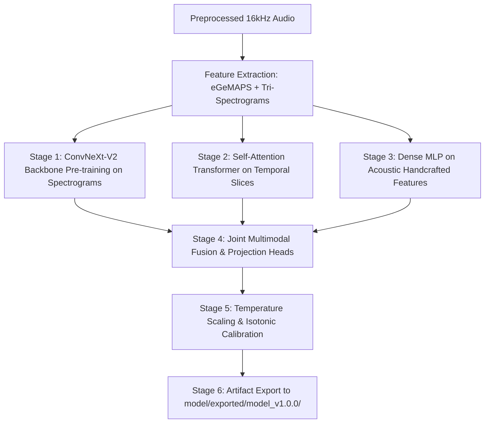

# Model Training & Calibration Pipeline

## 1. Overview & Objectives

This document details the multi-stage training pipeline for the multimodal Parkinson's voice classification model (`model_v1.0.0`), executed across Google Colab GPU runtimes and modularized in `model/notebooks/` and `model/src/`.

---

## 2. Multi-Stage Training Protocol

### Stage 1: Time-Frequency Feature Representation
- **Tri-Spectrogram Generation (`model/src/spectrograms/`)**:
  - **Channel 1 (Mel Spectrogram)**: 128 Mel bands, FFT length 2048, hop length 512 ($80\text{Hz} - 7600\text{Hz}$).
  - **Channel 2 (STFT Magnitude)**: Linear spectrogram capturing fine-grained harmonic formant energy.
  - **Channel 3 (Constant-Q Transform)**: Geometrically-spaced frequency bins emphasizing lower pitch register perturbations.

### Stage 2: Backbone & Branch Optimization
- **ConvNeXt-V2 Backbone (`model/notebooks/07_convnextv2.ipynb`)**:
  - Initialized with pre-trained weights; fine-tuned with AdamW optimizer, cosine annealing learning rate ($\text{lr} = 1\times 10^{-4}$ down to $1\times 10^{-6}$), weight decay $1\times 10^{-2}$.
  - SpecAugment time and frequency masking applied during training.
- **Temporal Transformer (`model/notebooks/08_transformer.ipynb`)**:
  - 4-layer multi-head self-attention over sequential $2.0\text{s}$ audio sliding windows with dropout $0.1$.

### Stage 3: Joint Multimodal Fusion (`model/notebooks/10_fusion.ipynb`)
- Concatenates the 512-dim visual representation, 256-dim temporal context vector, and 128-dim acoustic embedding.
- Passes through a gated residual fusion projection head to produce raw logit predictions.

### Stage 4: Probability Calibration (`model/notebooks/12_calibration.ipynb`)
- Evaluates raw logit reliability diagrams.
- Fits non-parametric Isotonic Regression and Platt scaling to minimize Expected Calibration Error (ECE) to $< 0.05$.
- Configuration stored in `model/configs/calibration_config.yaml`.

---

## 3. Checkpoint & Artifact Management

- **Model Weights**: Stored in `model/exported/model_v1.0.0/` (`model.pt`, `calibration.json`, `config.yaml`).
- **Data Split Tracking**: Patient-level stratification saved in `model/artifacts/data_manifest_v1.0-20260823.json`.
