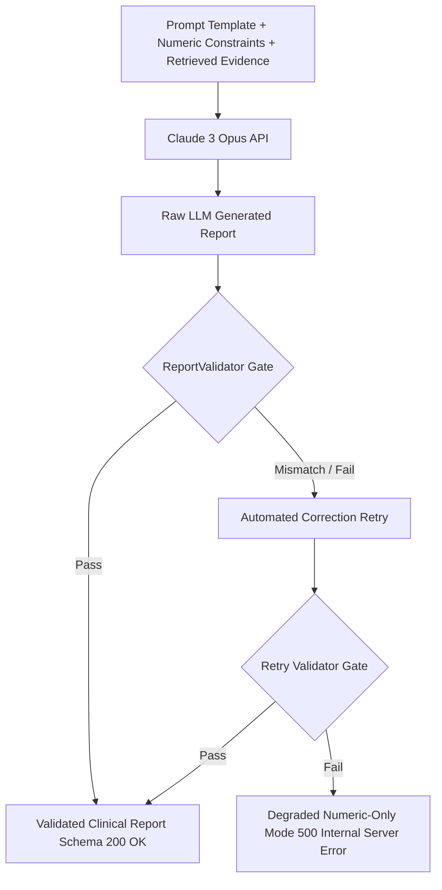

# LLM Clinical Synthesis & Output Validation

## 1. Overview & Safety-First Philosophy

Clinical reports synthesized by Large Language Models must be strictly deterministic regarding numbers and disclaimers. The system combines Anthropic Claude 3 Opus with an automated, zero-tolerance post-generation validation gate (`ReportValidator`).

---

## 2. Prompt Engineering (`rag/prompts/report_prompt_template.md`)

- **System Role**: Specialized clinical speech pathology assistant.
- **Strict Numeric Boundaries**:
  - The model is supplied with explicit numeric anchors (`[NUMERIC_VALUES]`: probability, confidence, audio quality).
  - Explicit instruction forbids altering, rounding, or interpolating numeric scores.
- **Section Headers Enforced**:
  - Administrative Session Info
  - Primary Screening Assessment
  - Acoustic Biomarker Findings
  - Temporal & Spectrogram Observations
  - Grounded Clinical Evidence with Citations
  - Clinical Recommendations & Follow-Up
  - Non-Dismissible Regulatory Disclaimer

---

## 3. Automated Output Validation (`backend/rag/output_validator.py`)

Every generated report must pass programmatic schema validation before transmission to client interfaces:

1. **Exact Numeric Matching**:
   - The calibrated probability in narrative text must equal the model's computed value within $\pm 0.005$.
2. **Mandatory Regulatory Disclaimer Check**:
   - Must contain the exact uppercase string:
     `"THIS IS AN AI‑BASED SCREENING/DECISION‑SUPPORT OUTPUT, NOT A STANDALONE DIAGNOSIS."`
3. **Structured Pydantic Parsing**:
   - Extracted text is mapped to `ReportSchema` (`backend/schemas/report.py`).

---

## 4. Degraded Fallback Mode

If LLM generation fails or produces unvalidated numeric hallucinations after one automated retry:
- The system gracefully degrades to **Degraded Mode** (`HTTP 500` with detail `"Report generation degraded – numeric results only."`).
- The frontend UI displays raw numeric gauge readings alongside clear warnings that narrative synthesis is unavailable, preventing medical misinterpretation.
