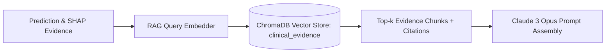

# Retrieval-Augmented Generation (RAG) Architecture

## 1. Overview & Clinical Evidence Ingestion

The RAG subsystem enriches clinical screening reports with grounded evidence retrieved from peer-reviewed neurological literature, acoustic diagnostic standards, and the Movement Disorder Society Unified Parkinson's Disease Rating Scale (MDS-UPDRS Part III Speech motor criteria).

---

## 2. Vector Database & Storage (`backend/rag/retriever.py`)

- **Vector Engine**: ChromaDB persistent client (`settings.VECTOR_DB_PATH`).
- **Collection Name**: `clinical_evidence`
- **Embedding Dimensionality**: 384-dimensional dense semantic vectors.
- **Chunking Strategy**: Overlapping semantic chunking ($250\text{ words}$ with $50\text{ word}$ overlap) preserving citation metadata (Authors, DOI/PMID, Source Title, Year).

---

## 3. Query Construction & Retrieval Pipeline

1. **Query Synthesis (`_build_query_text`)**:
   - Assembles prediction label, confidence level, and the top 3 highest-magnitude SHAP acoustic features (e.g. `"elevated micro-pitch jitter, reduced harmonics-to-noise ratio, formant bandwidth divergence"`).
2. **Deterministic Query Embedding**:
   - Embeds query text using the same embedding function used during offline document ingestion.
3. **Similarity Search**:
   - Performs cosine similarity retrieval in ChromaDB fetching top $k=3$ relevant literature chunks.
4. **Metadata Preservation**:
   - Preserves source titles, publication identifiers, and evidence excerpts for inclusion in the final clinical report citations table.
