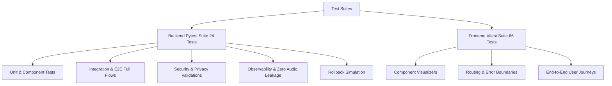

# Testing & Quality Assurance Architecture

## 1. Overview & Test Hierarchy

The project implements a multi-tier testing strategy ensuring data contract integrity, zero privacy leakage, mathematical calibration accuracy, and regression-free user journeys.



---

## 2. Backend Test Suites (`tests/`)

### Test Breakdown (24 Tests)
1. **End-to-End Full Flows (`tests/end_to_end/test_e2e_full_flows.py`)**:
   - `test_clean_speech_upload_full_lifecycle`: Exercises upload $\rightarrow$ inference $\rightarrow$ DB persistence $\rightarrow$ XAI $\rightarrow$ clinical report.
   - `test_streaming_flow_multi_window_aggregation`: Verifies WebSocket chunk streaming, rolling window accumulation, and live prediction updates.
   - `test_patient_longitudinal_history_ordering`: Verifies multi-session chronological history ordering.
2. **End-to-End Error Paths (`tests/end_to_end/test_e2e_error_paths.py`)**:
   - `test_rejected_quality_audio_path`: Suboptimal audio triggers low quality score.
   - `test_oversized_audio_upload_rejection`: Payloads $>25\text{MB}$ receive HTTP 413.
   - `test_unsupported_audio_format_rejection`: Invalid MIME types receive HTTP 400.
   - `test_nonexistent_session_queries`: Missing sessions receive HTTP 404.
   - `test_report_degraded_fallback_on_validator_failure`: Validation failures trigger clean degraded fallback.
3. **Integration Smoke Tests (`tests/integration/test_end_to_end_integration.py`)**:
   - Tests health checks, upload workflows, and WebSocket streaming.
4. **Security & Privacy (`tests/test_security.py`)**:
   - Tests file caps, CORS origin restrictions, 30-day audio retention purges, prompt-injection regex neutralization, and clinical audit logging.
5. **Observability & Privacy Shield (`tests/test_observability.py`)**:
   - Verifies request ID correlation, latency tracking, extended health check reporting, and asserts **zero raw audio byte leakage** across all log records.
6. **Rollback Verification (`tests/test_rollback.py`)**:
   - Tests dynamic model version switching and health check parity during release rollback.

### Running Backend Tests
```bash
backend/pd-voice-backend/bin/python -m pytest tests/ -v
```

---

## 3. Frontend Test Suites (`frontend/src/tests/`)

### Test Breakdown (66 Tests across 10 suites)
1. `EndToEndFlow.test.tsx` (1 test): Complete clinical journey from upload to result to report to history.
2. `HistoryPage.test.tsx` (6 tests): Longitudinal charts, CI area bands, quality warning badges, patient lookup.
3. `ReportPage.test.tsx` (4 tests): Clinical report rendering, print CSS, degraded mode fallback.
4. `XaiComponents.test.tsx` (10 tests): Grad-CAM canvas rendering, Attention Timeline rollout, SHAP feature bars.
5. `ResultPage.test.tsx` (9 tests): Probability gauge, risk categories, quality rejection banners.
6. `UploadPage.test.tsx` (11 tests): File picker, drag-and-drop, format validation, upload progress.
7. `RecordPage.test.tsx` (3 tests): Live microphone capture UI, timer, quality indicator.
8. `useMicStream.test.ts` (7 tests): MediaRecorder chunks and WebSocket streaming logic.
9. `components.test.tsx` (8 tests): Base UI components and layout rendering.
10. `router.test.tsx` (7 tests): SPA routing and persistent footer disclaimer.

### Running Frontend Tests
```bash
cd frontend
npm test
npm run build
```
